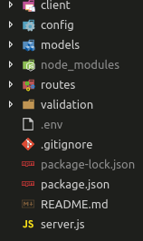

# What does this project use?

- React 16.5
- MongoDB
- Express
- mLab
- React Router
- Redux
- Redux-Thunk
- Axios

# How to Run

- `git clone` The project
- in the root folder, run `npm install`
- in the `client` folder, run `npm install` again
- in a terminal window, be in the root folder and type `npm run dev` to load up the project.
- Server runs on port 5000, Front end runs on 3000

# dotEnv File

- This project has a `.env` file that is necessary.
- The `.env` should be in the root directory.
  <figure>
      
  </figure>
- You will need to supply your own `MONGOUSER` and `MONGOPASS` in that file.

Example .env file

<code>
 
    MONGOUSER: YOURUSERNAME 
    MONGOPASS: YOURPASSWORD 
</code>

